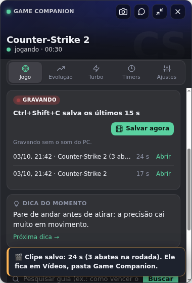
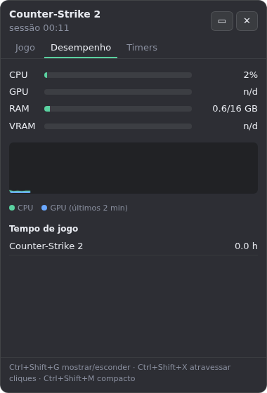
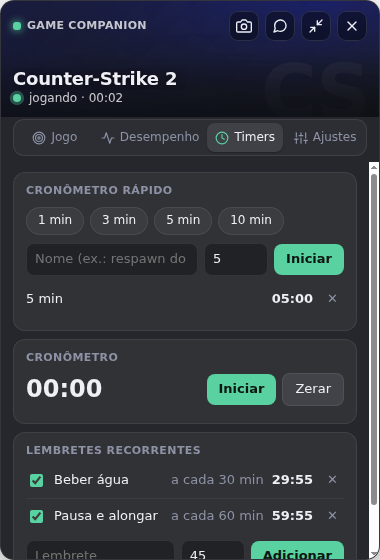

# Game Companion

Um painel que fica por cima do jogo (overlay) no PC, com três partes:

- **Jogo**: detecta sozinho o jogo aberto, mostra uma dica a cada 90 segundos, atalhos para guias e wikis, busca de guia no Google e um bloco de anotações por jogo. Reconhece **qualquer jogo**: os da lista, os instalados pela Steam, Epic e GOG, os que estão nas pastas de jogos (Xbox, Riot, EA, Ubisoft, Rockstar...) e qualquer programa em tela cheia. Se ele confundir um programa com jogo, toque em "Não é um jogo".
- **CS2 ao vivo**: pelo Game State Integration (recurso oficial da Valve), mostra mapa, rodada, placar, seu K/A/D, dinheiro, vida e dicas do mapa. No fim da partida, ela é registrada sozinha em Partidas, na janela do Claude. O app coloca o arquivo `gamestate_integration_gamecompanion.cfg` na pasta `cfg` do CS2; feche e abra o CS2 uma vez depois da primeira vez que abrir o app.
- **Desempenho**: FPS do jogo (com o PresentMon da Intel, que já vem junto; na primeira vez pode pedir permissão de administrador), uso de CPU, GPU, RAM e VRAM, temperaturas, gráfico dos últimos 2 minutos, **FPS médio de cada sessão** por jogo, sessões recentes e total de horas jogadas por jogo.
- **Resumo da sessão**: ao fechar um jogo (depois de 2 minutos ou mais), o painel mostra tempo, FPS médio, FPS mais baixo e a comparação com a sua média. Dá para avaliar a sessão (👍 😐 👎) e deixar um comentário.
- **Timers**: cronômetros rápidos (1, 3, 5, 10 min ou com nome), cronômetro normal e lembretes recorrentes (ex.: beber água a cada 30 min). Quando um timer acaba, o painel aparece, toca um bipe e mostra um aviso.

  

## Atalhos

| Atalho | O que faz |
| --- | --- |
| Ctrl+Shift+G | Mostrar ou esconder o painel |
| Ctrl+Shift+X | Deixar os cliques "atravessarem" o painel (para jogar com ele aberto) |
| Ctrl+Shift+M | Modo compacto (uma linha com jogo, tempo, CPU/GPU e próximo timer) |
| Ctrl+Shift+W | Abrir a janela do Claude dentro do app (perguntas, partidas, imagens com dicas) já no jogo detectado |
| Ctrl+Shift+P | Tirar print da tela e mandar para a leitura do placar na janela do Claude |

Arraste o painel pelo título para mudar de lugar.

O app fica com um ícone perto do relógio do Windows: clique para mostrar ou esconder o painel; com o botão direito há "Iniciar com o Windows" (abre escondido, só o ícone) e "Sair".

## Como rodar no Windows

1. Instale o [Node.js](https://nodejs.org) (versão LTS).
2. Abra o terminal nesta pasta e rode:
   ```
   npm install
   npm start
   ```
3. Para gerar um `.exe` portátil (fica em `dist/`): `npm run dist`. O ícone fica em `build/icon.ico` e o PresentMon em `vendor/`.

Na primeira vez que abrir a janela do Claude (Ctrl+Shift+W ou 🤖), entre na sua conta do Claude. O login fica salvo.

Aviso de atualização: o app confere as versões publicadas em https://github.com/pedrooriani9p-oss/game-companion/releases e avisa no painel quando sai uma nova.

**Importante:** o painel só aparece por cima de jogos em **tela cheia sem bordas** (borderless / "janela sem bordas"). Em tela cheia exclusiva o Windows não deixa nenhum overlay aparecer.

## Adicionar jogos e dicas

Edite `data/games.json`. Cada jogo tem `name`, `steamAppId` (opcional), `exe` (nome do executável), `tips` e `guides`. Para modpacks do Minecraft, `cmdlineMatch` diferencia pelo nome da instância (ex.: "cobblemon"). Jogos fora da lista também são detectados e têm o tempo e o FPS contados; as dicas deles vêm do Claude (🤖), que cria o jogo na hora na janela do Claude.

Os dados (anotações, horas, lembretes) ficam em `%APPDATA%\game-companion\data.json`.

## Testes

`npm test` roda os testes da lógica (detecção de jogo, Steam, Epic, GOG, janela em primeiro plano, CS2 ao vivo, FPS, armazenamento).

## Próximos passos possíveis

- Timers específicos por jogo (ex.: respawn de objetivos).
- Modo ao vivo para outros jogos com integração oficial (ex.: Dota 2).
