# Game Companion

Um painel que fica por cima do jogo (overlay) no PC. No topo aparece a capa do jogo (a arte que a Steam guarda no PC, ou baixada da loja; jogos fora da Steam ganham um degradê com as iniciais), o tempo da sessão e o FPS. As abas são:

- **Jogo**: detecta sozinho o jogo aberto, mostra uma dica a cada 90 segundos, atalhos para guias e wikis, busca de guia no Google e um bloco de anotações por jogo. Reconhece **qualquer jogo**: os da lista, os instalados pela Steam, Epic e GOG, os que estão nas pastas de jogos (Xbox, Riot, EA, Ubisoft, Rockstar...) e qualquer programa em tela cheia. Se ele confundir um programa com jogo, toque em "Não é um jogo".
- **CS2 ao vivo**: pelo Game State Integration (recurso oficial da Valve), mostra mapa, rodada, placar, seu K/A/D, dinheiro, vida e dicas do mapa. No fim da partida, ela é registrada sozinha em Partidas, na janela do Claude. O app coloca o arquivo `gamestate_integration_gamecompanion.cfg` na pasta `cfg` do CS2; feche e abra o CS2 uma vez depois da primeira vez que abrir o app.
- **Modo ao vivo em outros jogos** (aparece na aba Jogo quando o jogo abre):
  - **Valorant**: estado (menu, seleção de agentes, em partida), mapa, modo, placar, seu agente e dicas do mapa. No fim, a partida vai para Partidas com K/A/D, ACS e % de tiros na cabeça. Usa só a API local do Riot Client e os dados do próprio jogador; não lê a memória do jogo nem mostra nada dos outros jogadores.
  - **Minecraft e Cobblemon**: lê o `logs/latest.log` (Minecraft normal, CurseForge, Modrinth, Prism, ATLauncher, Technic). Conta mortes, conquistas e capturas da sessão e avisa na hora. No fim, escreve um resumo no Diário.
  - **TF2**: precisa da opção de inicialização `-condebug` na Steam. Mostra abates, mortes, K/D, sequência, arma com mais abates e quem mais te matou. Cada mapa vira uma partida.
  - **Stardew**: lê o save do dia (`SaveGameInfo`): fazenda, data, dinheiro, habilidades e dicas da estação. Avisa quanto ganhou ao dormir e escreve o resumo no Diário.
- **Coach IA**: no fim de cada partida do CS2, Valorant ou TF2, o app compara a partida com a sua média (K/D, mortes, abates, tiros na cabeça, mapa, sequência) e pede ao Claude uma dica curta para a próxima. A dica aparece no aviso, no HUD, em voz (se ligada) e na aba Jogo, com um botão para conversar mais com o Claude sobre a partida. No começo da partida seguinte, o HUD lembra a dica. Sem o Claude (ou com "Pedir a dica ao Claude" desligado), fica uma dica rápida feita pelo próprio app. Usa só os números do próprio jogador.
- **Pergunta rápida no jogo**: Ctrl+Shift+A abre uma caixinha por cima do jogo (jogo em janela ou tela cheia sem borda): você escreve, o Claude responde em texto, no HUD e em voz, já sabendo o seu mapa, placar, lado e K/A/D de agora, as suas partidas, metas e anotações. A conversa continua entre uma pergunta e outra, e as respostas são curtas (até 3 frases). Esc fecha; voltar ao jogo também. O app só passa para o Claude o que o jogo mostra para você (o seu mapa, placar, lado e números, nunca os de outros jogadores) e a resposta é feita só com isso e com o que você escreve. Usa a janela do Claude escondida; "Deixar o Claude pronto durante o jogo" (Ajustes) abre essa janela sozinha ao abrir um jogo, para a primeira resposta sair rápido (usa mais memória). Ela fecha sozinha depois de 12 minutos sem uso quando não há jogo aberto.
- **App e página conversam**: com "Ligar o app à página do Claude" ligado (Ajustes), a página mostra no Início o jogo que você está jogando agora (mapa, placar, números) e o Claude passa a considerar isso nas respostas; as dicas do coach vão para o Início da página; as metas do app (K/D, vitórias, horas...) aparecem na página, com a barra de progresso, junto com as metas escritas lá; e, na aba Evolução do app, as metas escritas na página aparecem para marcar ou criar. Desligando, nada disso é enviado.
- **Evolução**: histórico de todas as partidas (as do modo ao vivo e as anotadas na janela do Claude, à mão ou pelo print do placar), por jogo e por período (7 dias, 30 dias ou tudo). Mostra partidas, % de vitórias, K/D e tempo com a comparação com o período anterior, um gráfico de K/D por partida com a média das últimas 5, tempo de jogo por dia, mapas com o seu melhor e o seu pior, recordes (mais abates, melhor K/D, vitórias seguidas, sessão mais longa), **metas** (K/D, % de vitórias, abates por partida, partidas na semana, limite de horas na semana) com aviso quando bate, e a semana atual contra a passada. O botão "Pedir dicas ao Claude" manda esse resumo para a pergunta do Claude. Toda segunda-feira aparece um aviso com o resumo da semana que passou. O cartão "Dicas do coach" junta as dicas das últimas partidas do jogo.
- **Turbo**: FPS do jogo (com o PresentMon da Intel, que já vem junto; na primeira vez pode pedir permissão de administrador), uso de CPU, GPU, RAM e VRAM, temperaturas e gráfico dos últimos 2 minutos. **O que está pesando**: os programas que mais usam o PC agora, com um botão para fechar (Windows, drivers, antivírus, Steam e anti-cheats ficam de fora). **Quedas de FPS**: quando o FPS cai, o app anota a hora e o motivo provável (programa pesado, placa de vídeo ou processador no limite, memória cheia, PC quente) e avisa. Também avisa quando o PC esquenta, liga o plano **Alto desempenho** do Windows enquanto joga (e volta ao normal depois) e mostra o FPS médio de cada sessão. **Internet**: ping, perda de pacotes e oscilação no último minuto, até a internet (1.1.1.1, ou o endereço escolhido em Ajustes) e até o seu roteador, com um gráfico e o diagnóstico (falha no Wi-Fi de casa ou na internet). Avisa quando a conexão fica instável durante o jogo.
- **HUD no jogo**: um mini painel por cima do jogo que deixa os cliques passarem, com FPS, CPU e GPU, ping, tempo de sessão, relógio, o próximo timer, a dica do coach e, no CS2, placar, dinheiro e uma **dica de compra** no começo da rodada (compra completa, eco ou force, pela sua economia). Escolha o canto e o que aparece em Ajustes. Ctrl+Shift+H mostra ou esconde.
- **Clipes**: com os clipes ligados em Ajustes, o app grava a tela enquanto você joga e guarda só os últimos 15, 30 ou 60 segundos. Ctrl+Shift+C (ou o botão na aba Jogo ou Clipes) salva o clipe em Vídeos, pasta Game Companion. Pode salvar sozinho em jogadas boas (3 ou mais abates numa rodada do CS2, sequência de 5 no TF2). Gravar usa um pouco do PC: se o FPS cair, use 720p. A aba **Clipes** mostra todos os clipes da pasta com miniatura; no player dá para assistir, marcar o início e o fim e **salvar o corte**, fazer a **versão para o Discord** (até 10 MB, o limite sem Nitro), **copiar** o vídeo (Ctrl+V no Discord ou WhatsApp já anexa), mostrar na pasta ou mandar para a lixeira. O corte toca o trecho escondido e grava de novo, então leva o tempo do trecho.
- **Avisos falados**: o app fala em português (voz do Windows) a dica de compra do CS2 no começo da rodada, timers e lembretes, a dica do coach, internet instável, metas batidas e, se quiser, queda de FPS. Cada um liga e desliga em Ajustes, com volume.
- **Resumo da sessão**: ao fechar um jogo (depois de 2 minutos ou mais), o painel mostra tempo, FPS médio, FPS mais baixo e a comparação com a sua média. Dá para avaliar a sessão (👍 😐 👎) e deixar um comentário.
- **Timers**: cronômetros rápidos (1, 3, 5, 10 min ou com nome), cronômetro normal, lembretes recorrentes (ex.: beber água a cada 30 min) e um limite de horas de jogo por dia. Quando um timer acaba, o painel aparece, toca um bipe e mostra um aviso.

- **Ajustes**: transparência do painel, tamanho (Normal ou Grande), posição em qualquer canto da tela, avisos no canto da tela, som dos timers, iniciar com o Windows, HUD no jogo, Coach IA, avisos falados, internet, clipes, atalhos e atualização automática.

Os avisos (partida registrada, morte no Minecraft, dia salvo no Stardew, print do placar) aparecem no canto da tela mesmo com o painel escondido.

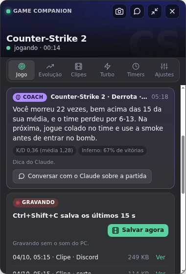 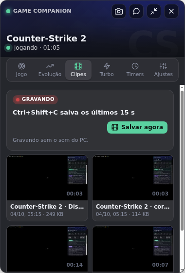 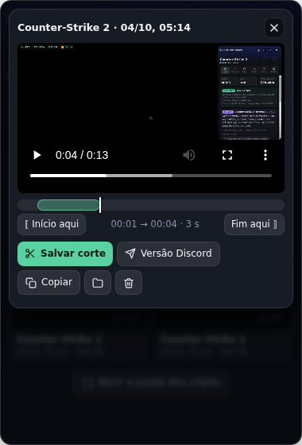 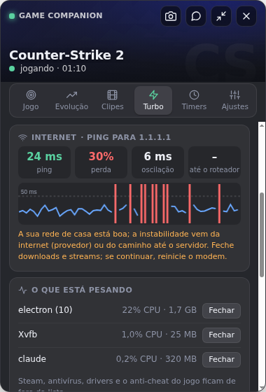

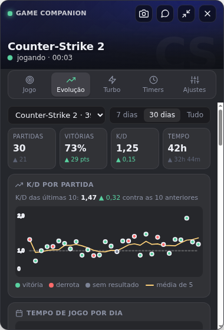 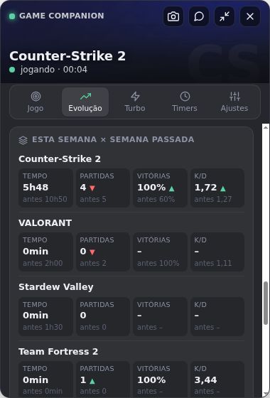 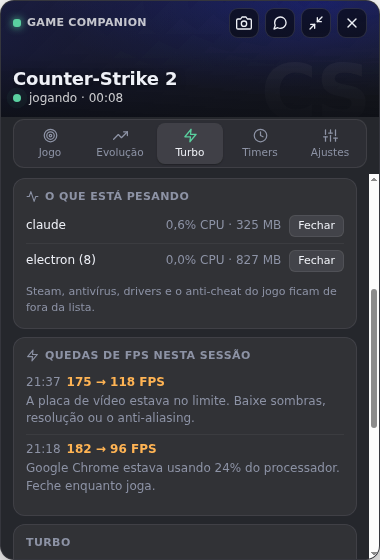 

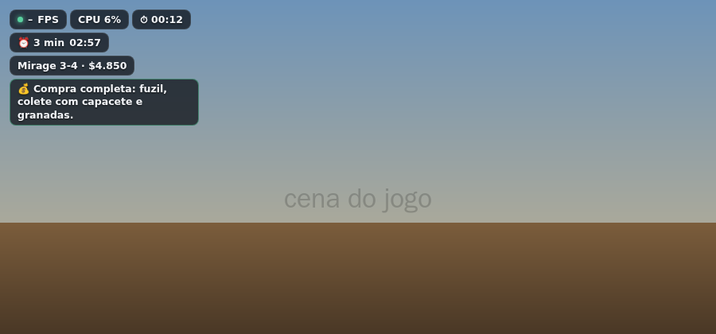 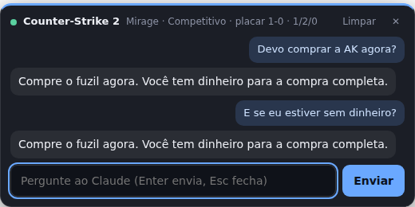 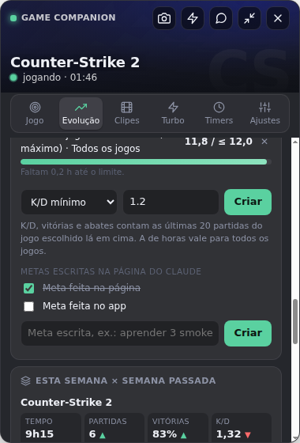 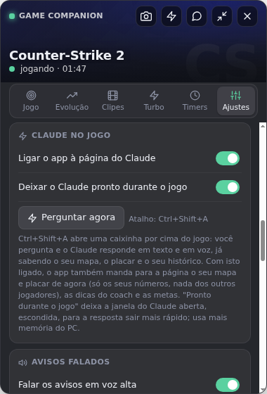

## Atalhos

| Atalho | O que faz |
| --- | --- |
| Ctrl+Shift+G | Mostrar ou esconder o painel |
| Ctrl+Shift+X | Deixar os cliques "atravessarem" o painel (para jogar com ele aberto) |
| Ctrl+Shift+M | Modo compacto (uma linha com jogo, tempo, CPU/GPU e próximo timer) |
| Ctrl+Shift+W | Abrir a janela do Claude dentro do app (perguntas, partidas, imagens com dicas) já no jogo detectado |
| Ctrl+Shift+P | Tirar print da tela e mandar para a leitura do placar na janela do Claude |
| Ctrl+Shift+H | Mostrar ou esconder o HUD no jogo |
| Ctrl+Shift+A | Pergunta rápida ao Claude: caixinha por cima do jogo, resposta em texto e voz |
| Ctrl+Shift+C | Salvar um clipe com os últimos segundos (com os clipes ligados) |

Arraste o painel pelo título para mudar de lugar.

O app fica com um ícone perto do relógio do Windows: clique para mostrar ou esconder o painel; com o botão direito há "Iniciar com o Windows" (abre escondido, só o ícone) e "Sair".

## Como rodar no Windows

1. Instale o [Node.js](https://nodejs.org) (versão LTS).
2. Abra o terminal nesta pasta e rode:
   ```
   npm install
   npm start
   ```
3. Para gerar um `.exe` portátil (fica em `dist/`): `npm run dist`. O ícone fica em `build/icon.ico` e o PresentMon em `vendor/`.

Na primeira vez que abrir a janela do Claude (Ctrl+Shift+W ou 🤖), entre na sua conta do Claude. O login fica salvo.

Atualização: o app confere as versões publicadas em https://github.com/pedrooriani9p-oss/game-companion/releases ao abrir e a cada 6 horas. No `.exe` portátil, ele baixa a versão nova sozinho (conferindo o tamanho e o SHA-256 publicados no GitHub) e troca o arquivo quando você fecha o app, no mesmo lugar e com o mesmo nome, então atalhos e o "Iniciar com o Windows" continuam funcionando. O botão "Reiniciar e atualizar" no painel (ou no ícone perto do relógio) faz a troca na hora. Dá para desligar em Ajustes; aí ele só avisa.

**Importante:** o painel e o HUD só aparecem por cima de jogos em **tela cheia sem bordas** (borderless / "janela sem bordas"). Em tela cheia exclusiva o Windows não deixa nenhum overlay aparecer.

## Adicionar jogos e dicas

Edite `data/games.json`. Cada jogo tem `name`, `steamAppId` (opcional), `exe` (nome do executável), `tips` e `guides`. Para modpacks do Minecraft, `cmdlineMatch` diferencia pelo nome da instância (ex.: "cobblemon"). Jogos fora da lista também são detectados e têm o tempo e o FPS contados; as dicas deles vêm do Claude (🤖), que cria o jogo na hora na janela do Claude.

Os dados (anotações, horas, lembretes) ficam em `%APPDATA%\game-companion\data.json`.

## Testes

`npm test` roda os testes da lógica (detecção de jogo, Steam, Epic, GOG, janela em primeiro plano, CS2 ao vivo e dica de compra, modos ao vivo, Evolução e metas, coach, ping e perda de pacotes, Turbo, galeria e duração dos clipes, atualização, armazenamento, ligação com a página: o que vai ao vivo, quando e como limpar a resposta).

## Próximos passos possíveis

- Timers específicos por jogo (ex.: respawn de objetivos).
- Modo ao vivo para outros jogos com integração oficial (ex.: Dota 2).
